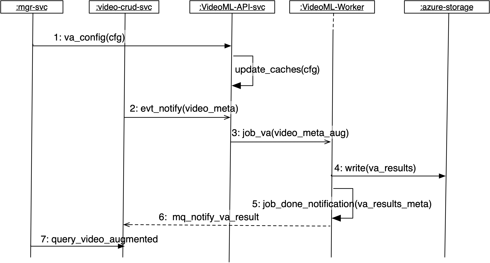

# 视频分析接口设计

### 子系统组成与交互
- mgr-svc: 管控中心后端
- video-crud-svc: 视频文件CRUD微服务, 包括: 事件视频上传微服务, 视频查询微服务, 视频录制微服务
- videoML-API-svc: 视频分析restful api
- videoML-Worker: 视频分析异步任务处理器
- azure-storage: 视频云存储

### 接口定义
- [videoML-API-svc API spec (OpenAPI 3.0)](video.ai.api.yml)
- [videoML-API-svc MQTT spec](video.ai.mq.yml)